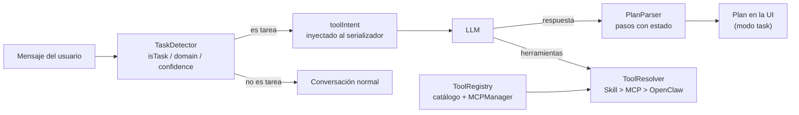

# Detección y ejecución de tareas (`core/task/`)

Pipeline de _tareas_ del asistente: decide si un mensaje es una instrucción operativa (algo que ejecutar) o
conversación normal, clasifica el dominio, y mantiene el registro de herramientas disponibles para
ejecutarla. Convive con el sistema de intenciones (`IntentDetector`) sin contaminar el prompt de
identidad con reglas de detección.

---

## `TaskDetector.js` — clasificador de intención operativa

| Campo        | Descripción                                                       |
| ------------ | ----------------------------------------------------------------- |
| `isTask`     | ¿Es una instrucción accionable o solo charla?                     |
| `domain`     | Área de la tarea: code, git, shell, web, filesystem, docker, etc. |
| `confidence` | high / medium / low / none                                        |
| `goal`       | Fragmento del texto que disparó la detección                      |

Filtra saludos, confirmaciones simples y preguntas existenciales antes de entrar en los patrones.
Los dominios están ponderados por peso (code=10, git=10, filesystem=9, shell=8, …); con matching
múltiple gana el mayor peso acumulado y `peso ≥ 20` se considera alta confianza.

## `PlanParser.js` — extracción de planes

Busca bloques `plan … ` en la respuesta del LLM y los convierte en pasos con estado (`done`),
con fallback a líneas `- [ ]` / `- [x]`. Devuelve `null` si no hay nada parseable.

## `ToolRegistry.js` — catálogo de herramientas

Registra los schemas de OpenClaw, navegador, escritorio nativo, procesos, cámara, Git, LSP y otras
herramientas integradas, y consulta al `MCPManager` por herramientas externas. El catálogo y los
schemas deben conservar paridad; `test_application_tool_parity` cubre la superficie de aplicaciones.

| Método                                              | Propósito                                                   |
| --------------------------------------------------- | ----------------------------------------------------------- |
| `getCatalog(domain?)`                               | Todas las herramientas, opcionalmente filtradas por dominio |
| `getToolById(id)`                                   | Lookup individual                                           |
| `serializeToPrompt(domain?, maxTools?)`             | Bloque de texto del system prompt con formato de uso        |
| `setMCPManager / setOpenClawBridge / setLSPManager` | Inyección de fuentes de herramientas                        |

Las herramientas de alto impacto (`highImpact: true`) marcan la aprobación requerida.

## `ToolResolver.js` — resolución del toolset

Decide, por turno, **qué herramientas ve el LLM** y con qué precedencia (Skill > MCP > OpenClaw):

- Colecciona herramientas de OpenClaw, LSP y MCP.
- **Excluye dominios superpuestos** (MCP excluye OpenClaw; skills excluyen por `replaces_domains`).
- Produce `nativeToolSchemas` (para tool-calling) y `promptCatalog` (texto del system prompt).
- Registra las exclusiones para auditoría.

---

## Cómo se integra

1. `TaskDetector.detect(userMessage)` clasifica la intención antes de armar el contexto.
2. `ToolResolver` combina schemas nativos, MCP, skills y disponibilidad efectiva.
3. `AgentLoop` genera o recupera un plan durable cuando la tarea lo requiere y ejecuta una acción
   observable por ciclo de interfaz.
4. Cada resultado vuelve al modelo para adaptar el siguiente paso; las mutaciones se verifican según
   el executor.
5. Una orden genérica como “continúa” retoma la intención activa más reciente del workspace y la UI
   vuelve a emitir ese plan, en vez de conservar visualmente el de una tarea anterior.

---

## Verificación

Ejecuta `test_tool_precedence`, `test_tool_visibility`, `test_tools_e2e`,
`test_task_detector_projects`, `test_goal_lifecycle` y `test_tool_calling`.
