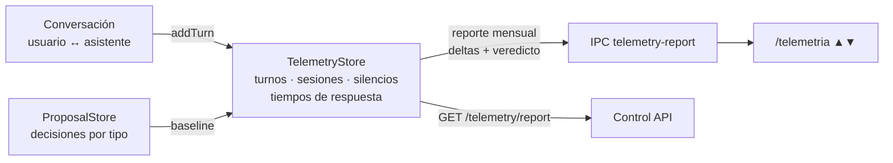

# Telemetría local (`core/telemetry/`)

Métrica local de uso para responder con datos — no con percepciones — _"¿estamos mejor que el mes
pasado?"_. `TelemetryStore` no contiene un transporte remoto; otros componentes sí pueden realizar
conexiones externas y se documentan por separado.

---

## `TelemetryStore.js`

Registra métricas de uso del asistente:

| Métrica                  | Qué mide                                                        |
| ------------------------ | --------------------------------------------------------------- |
| **Turnos**               | Mensajes del usuario procesados por el funnel de `Core.addTurn` |
| **Sesiones**             | Sesiones de conversación iniciadas/cerradas                     |
| **Silencios**            | Periodos sin interacción                                        |
| **Tiempos de respuesta** | Latencia de las respuestas del asistente                        |
| **Reporte mensual**      | Deltas y veredicto comparando el mes actual contra el anterior  |

### Persistencia

- Archivo local (`telemetry.json` en el directorio de datos del usuario).
- Conserva hasta 90 días y limita las muestras diarias para evitar crecimiento ilimitado.

### Exposición

- **IPC:** `telemetry-report` → el comando `/telemetria` responde con las flechas ▲/▼ del mes.
- **Control API:** endpoint `GET /telemetry/report`.

---

## Cómo se alimenta

`Core.addTurn()` registra cada turno (es el _funnel_ de toda conversación) y
`ProposalStore.getDecisions()` expone el historial de aceptación/descartes por tipo con timestamp —
eso da la **baseline** de aceptación por tipo de propuesta que consume el motor de decisión.

Ejecuta `tests/test_telemetry.js`.
