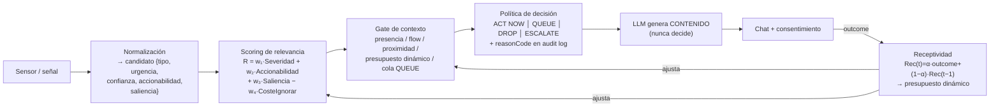

# Arquitectura de Kaoru

**Español** · [日本語](./i18n/ja/README.md) · [한국어](./i18n/ko/README.md) · [English (US)](./i18n/en-US/README.md) · [English (UK)](./i18n/en-GB/README.md) · [Português](./i18n/pt/README.md)

[← Centro de documentación](./README.md)

Documento de referencia de la arquitectura del sistema en su estado actual. Describe el flujo completo:
de la entrada del usuario a la respuesta, y de las señales del sistema al motor de proactividad, pasando
por el núcleo determinista de decisión, la memoria persistente y las capas de ejecución.

---

## 1. Vista general del sistema

```mermaid
flowchart TD
    subgraph UI["Capa UI (Electron renderer)"]
        CHAT["src/chat.html<br/>processMessage()"]
        INPUT["Mensaje del usuario<br/>@archivos / comandos / chat"]
        BUBBLE["Bubble de propuesta<br/>+ botones Sí/No"]
        MODEL["Modelo Live2D + TTS<br/>(march 7th.model3.json)"]
        COMMANDS["CommandRegistry<br/>/comandos"]
    end

    subgraph IPC["Capa IPC (main.js)"]
        ADD_TURN["ipcMain.on memory-add-turn<br/>→ Core.addTurn()"]
        BUILD_CTX["ipcMain.handle grounding-build-context"]
        AGENT_RUN["ipcMain.handle agent-run"]
        PROPOSAL_DEC["ipcMain.on initiative-decision<br/>→ Core.handleProposalDecision()"]
        TELEMETRY["ipcMain.handle telemetry-report<br/>/telemetry/report"]
        INITIATIVE_FWD["Core.onInitiative<br/>→ webContents.send initiative"]
    end

    subgraph CORE["Core (núcleo)"]
        ADD_TURN -->|"memory:turn-added"| PROACTIVE_ENGINE
        ADD_TURN --> TELEMETRY_STORE
        BUILD_CTX --> BUILD_CONTEXT
        AGENT_RUN --> RUN_AGENT

        subgraph CHAT_FLOW["Flujo conversacional (respuesta a mensaje)"]
            BUILD_CONTEXT["buildContext()<br/>• BehaviorModel.evaluate()<br/>• IntentDetector.detect()<br/>• TaskDetector.detect()<br/>• GroundingEngine<br/>• resolveToolset() (ToolResolver)<br/>• skills + MCP + OpenClaw catálogo<br/>• Modos: chat / plan / execute / agent"]
            AGENT_LOOP["AgentLoop<br/>loop LLM → tool → resultado → LLM<br/>presupuesto acotado y adaptativo"]
            REPO_INTEL["RepositoryIntelligence<br/>archivos · dependencias · impacto · tests"]
            LLM["LLMProvider<br/>complete() / completeWithTools()"]
            BUILD_CONTEXT --> LLM
            RUN_AGENT["runAgent()<br/>buildContext(mode:agent)"] --> REPO_INTEL --> AGENT_LOOP --> LLM
        end

        subgraph PROACTIVE["Motor de proactividad (decisión determinista)"]
            PROACTIVE_ENGINE["ProactiveEngine<br/>• gates pre-LLM (cooldown, presupuesto,<br/>chat reciente, AFK, lock)<br/>• _tryTrigger() → gate F-4 + consulta LLM<br/>• _generateMessage() (identidad del asistente)<br/>• _buildProposal() (determinista)"]
            PROACTIVE_ENGINE -->|"candidato normalizado"| DECISION_CORE["DecisionCore<br/>scoreRelevancia / receptividad /<br/>presupuesto / decide + AuditLog"]
            PROACTIVE_ENGINE -->|"señal → candidato"| NORMALIZER["SignalNormalizer<br/>payload de sensor →<br/>{tipo, urgencia, confianza,<br/>accionabilidad, saliencia}"]
            PROACTIVE_ENGINE -->|"contexto en vivo"| CONTEXT_GATE["ContextGate<br/>flow detection + presupuesto<br/>dinámico + cola QUEUE"]
            PROACTIVE_ENGINE -->|"tipos degradados"| SLO["SloMonitor<br/>aceptación / ignorados<br/>+ degradación automática"]
            PROACTIVE_ENGINE -->|"initiative:trigger"| INITIATIVE_FWD
            PROACTIVE_ENGINE -->|"feedback + cooldown"| PROPOSAL_STORE["ProposalStore<br/>decisiones por tipo (baseline)"]
            PROACTIVE_ENGINE -->|"propuesta aceptada"| EXECUTOR["ProactiveExecutor<br/>apply_patch / gitignore_add<br/>verificación LSP real + rollback"]
            EXECUTOR -->|"proposal:executed"| PROPOSAL_RESULT["onProposalResult → renderer"]
        end

        subgraph TELEM["Telemetría local"]
            TELEMETRY_STORE["TelemetryStore<br/>turnos, sesiones, silencios,<br/>tiempos de respuesta, reporte mensual"]
            TELEMETRY --> TELEMETRY_STORE
        end
    end

    subgraph SENSORS["Sensores de señales (EventBus)"]
        OS["OSSensor / LinuxOSSensor<br/>app activa + idle (idleSecs)"]
        GIT["GitWatcher<br/>git:redflag (.env, conflictos)"]
        SYS["SystemWatcher<br/>system:warning"]
        TITLE["TitleWatcher<br/>títulos de ventana"]
        CLIP["ClipboardWatcher (opt-in)<br/>clipboard:copied"]
        EVENTS["UpcomingEventsWatcher<br/>memory:upcoming-event"]
        LSP_W["LSPErrorWatcher<br/>lsp:error (severidad 1)"]
        SYMB["SymbolIndex<br/>símbolos LSP (contexto de parche)"]
        LSP_MANAGER["LSPManager<br/>typescript-language-server"]
        LSP_W --> SYMB
    LSP_W --> LSP_MANAGER
    SYMB --> REPO_INTEL
    end

    subgraph MEM["Memoria y estado"]
        GRAPH["StateGraph (sqlite / fallback RAM)<br/>WorldModel, Belief, episodios"]
        SESSION["SessionManager<br/>sesión + historial"]
        UPDATER["StateUpdater<br/>detectAndSaveInstant"]
        DETECTOR["IntentDetector (sqlite-vec)<br/>embeddings locales"]
        SKILLS["SkillManager<br/>skills indexadas"]
    end

    subgraph TOOLS["Herramientas de agente"]
        OPENCLAW["OpenClawBridge<br/>ejecutar comandos reales"]
        MCP["MCPManager<br/>servidores + catálogo"]
        BROWSER["BrowserBridge<br/>personal + administrado"]
        DESKTOP["DesktopAutomation<br/>accesibilidad + captura"]
        TASK["TaskDetector + ToolRegistry<br/>ToolResolver → toolset"]
    end

    INPUT --> CHAT
    CHAT -->|"/comando"| COMMANDS
    COMMANDS -->|"resultado directo"| BUBBLE
    CHAT -->|"llamada LLM simple"| BUILD_CTX
    CHAT -->|"modo con herramientas"| AGENT_RUN
    CHAT --> ADD_TURN
    PROPOSAL_DEC --> PROACTIVE_ENGINE
    INITIATIVE_FWD --> BUBBLE
    BUBBLE -->|"aceptar/rechazar"| PROPOSAL_DEC
    MODEL --> CHAT

    OS -->|"os:idle-changed / os:app-changed"| PROACTIVE_ENGINE
    GIT -->|"git:redflag"| PROACTIVE_ENGINE
    SYS -->|"system:warning"| PROACTIVE_ENGINE
    TITLE -->|"os:error-title"| PROACTIVE_ENGINE
    CLIP -->|"clipboard:copied"| PROACTIVE_ENGINE
    EVENTS -->|"memory:upcoming-event"| PROACTIVE_ENGINE
    LSP_W -->|"lsp:error"| PROACTIVE_ENGINE

    GRAPH --> BUILD_CONTEXT
    GRAPH --> PROACTIVE_ENGINE
    SESSION --> ADD_TURN
    UPDATER --> GRAPH
    DETECTOR --> BUILD_CONTEXT
    SKILLS --> BUILD_CONTEXT
    SKILLS --> RUN_AGENT
    LLM --> TOOLS
    OPENCLAW --> LLM
    MCP --> LLM
    BROWSER --> LLM
    DESKTOP --> LLM
    TASK --> BUILD_CONTEXT
```

---

## 2. Motor de decisión proactiva

Para las señales normalizadas de sensores, el motor decide con un **núcleo determinista** entre los
sensores y el engine. En esa ruta el LLM genera el contenido del mensaje (identidad + memoria +
anti-repetición), pero no autoriza su admisión. Algunos triggers heredados o no sensoriales conservan
un flujo distinto y deben analizarse desde su punto de entrada.

### Componentes

| Módulo                              | Responsabilidad                                                                                                                                     |
| ----------------------------------- | --------------------------------------------------------------------------------------------------------------------------------------------------- |
| `core/decision/DecisionCore.js`     | Funciones puras: `scoreRelevancia`, `receptividad`, `presupuesto`, `decide` con reason codes + audit log.                                           |
| `core/decision/SignalNormalizer.js` | Convierte el payload de cada sensor en un candidato normalizado; deriva perfiles genéricos para señales desconocidas y permite `registerProfile()`. |
| `core/decision/ContextGate.js`      | Valida el momento: flow de trabajo, proximidad conversacional, presupuesto dinámico y cola de diferidos (QUEUE).                                    |
| `core/decision/SloMonitor.js`       | SLOs por tipo de señal (aceptación mínima, ignorados máximos) con degradación automática y telemetría de "tasa de no-molestia".                     |

### Flujo de decisión en detalle

1. **Sensado** — un sensor emite una señal cruda por el EventBus (`os:app-changed`, `git:redflag`, `lsp:error`, …).
2. **Normalización** — `SignalNormalizer` produce un candidato `{tipo, urgencia, confianza, accionabilidad, saliencia, payload, ts}`.
3. **Scoring** — `DecisionCore.scoreRelevancia()` calcula la relevancia ponderada de la señal.
4. **Gate de contexto** — si el momento no es adecuado (trabajo profundo, usuario ausente, chat reciente), la señal se **difiere** (QUEUE) o se descarta con motivo.
5. **Política** — con el score y el estado del gate se decide `ACT NOW`, `QUEUE`, `DROP` o `ESCALATE`, registrando el `reasonCode`.
6. **Generación** — solo si toca actuar, el LLM redacta el mensaje con identidad y memoria factual.
7. **Entrega** — la propuesta se muestra en el chat con botones de consentimiento.
8. **Outcome** — la aceptación/rechazo retroalimenta la receptividad, que ajusta el presupuesto diario y los pesos.

---

## 3. Flujo conversacional

1. `buildContext()` ensambla identidad (`core/identity/identity.json`), contexto del SO, memoria recuperada del `StateGraph`, intención (`IntentDetector`) y catálogo de herramientas (`ToolResolver`).
2. Según el modo (`chat | plan | execute | agent`), la respuesta se genera con `LLMProvider.complete()` o con el `AgentLoop` (tool-calling nativo + fallback textual).
3. Las acciones se clasifican fuera del LLM. Las que resuelven a `ask` pasan por aprobación explícita
   del usuario (IPC `agent-approval-needed`); `allow` y `deny` se aplican directamente según política.
4. La sesión se persiste incrementalmente (`SessionManager` + `StateUpdater`).

Para tareas de código complejas, `RepositoryIntelligence` sustituye el antiguo árbol superficial de
directorios. Su índice asíncrono aporta al plan rutas reales, dependencias locales, símbolos y scripts.
Después de una mutación se invalida, calcula el radio de impacto y antepone pruebas focales solo si el
repositorio expone un runner conocido. La verificación general configurada sigue siendo el sello final.

---

## 4. Principios de diseño

- **Aditivo:** el pipeline proactivo nunca degrada la conversación normal.
- **Determinista donde importa:** la decisión de hablar es trazable (score + reason code); el LLM solo redacta.
- **Recuperación explícita:** las rutas de mutación integran checkpoint y verificación cuando
  corresponde; el rollback es una operación separada y puede ser parcial o encontrar conflictos.
- **Persistencia local, cómputo configurable:** memoria, embeddings y telemetría residen en la máquina; prompts, contexto seleccionado, resultados de herramientas y capturas pueden salir al proveedor LLM o integración elegida.
- **Extensible:** MCP, skills y perfiles de señal se agregan sin tocar el núcleo.

## 5. Límites de confianza y datos

- El navegador personal solo recibe una URL al usar `open_website`; Kaoru no importa directamente sus cookies ni contraseñas. El navegador administrado mantiene un perfil separado para tareas verificables.
- Las observaciones de escritorio se obtienen mediante AT-SPI2 (Linux) o UI Automation (Windows). El clic visual se liga a una captura efímera y requiere una nueva observación después de cada mutación.
- Los interruptores de capacidad separan aplicaciones, navegador, pantalla, puntero, teclado, procesos y cámara. Desactivar una familia bloquea sus herramientas antes de ejecutarlas.
- MCP y plugins amplían el límite de confianza: pueden procesar contexto de la tarea según su implementación y deben instalarse solo desde fuentes confiables.
- Los resultados externos se delimitan como no confiables antes de entrar al prompt. Esta defensa reduce el riesgo de prompt injection, pero no lo elimina.

La descripción completa de categorías, transferencias y retención está en el [aviso de privacidad](./web/privacy.html).
