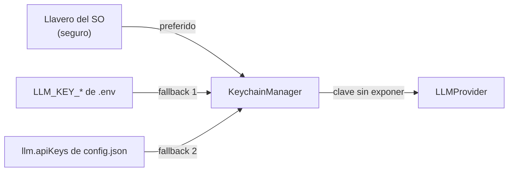

# Llavero del sistema operativo (`infrastructure/keychain/`)

Custodia preferente de credenciales (API keys de LLM y secretos compatibles) mediante el almacén
seguro del sistema operativo.

---

## `KeychainManager.js`

**Responsabilidades:**

- Almacenar y recuperar API keys por proveedor (Groq, Gemini, OpenAI, proveedores personalizados).
- Detectar y usar el llavero disponible según plataforma.
- Fallback a configuración local (`config.json` / `.env`) cuando el llavero no está disponible.
- La API de configuración y la Control API redactan las llaves conocidas antes de responder.

**Fuentes de claves (en orden de preferencia):**

1. Llavero del SO (seguro).
2. `LLM_KEY_*` del `.env` del usuario.
3. `llm.apiKeys` del `config.json` del usuario.

---

## Seguridad

- Si el llavero no está disponible, `.env` o `config.json` pueden contener secretos en texto plano.
  Ambos están ignorados por Git, pero el usuario debe proteger permisos de archivo, copias de
  seguridad y acceso al equipo.
- La Control API redacta las claves en cualquier respuesta.
- No debe interpretarse la redacción como garantía para valores arbitrarios incluidos por plugins,
  comandos o mensajes de error.

## Verificación

Ejecuta `test_keychain_integration`, `test_server_security` y `test_safe_storage_fallback`.
